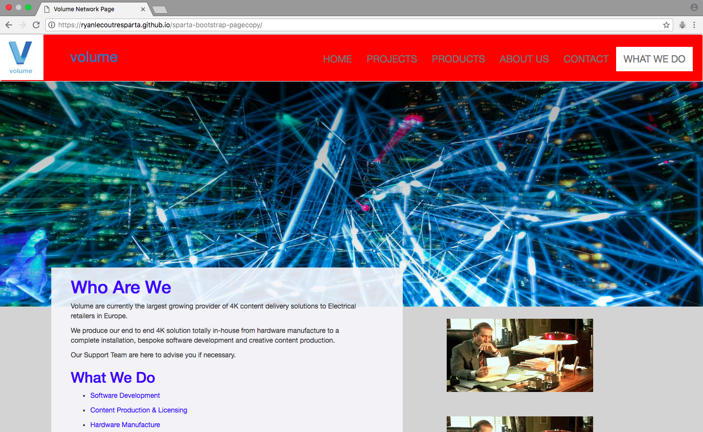
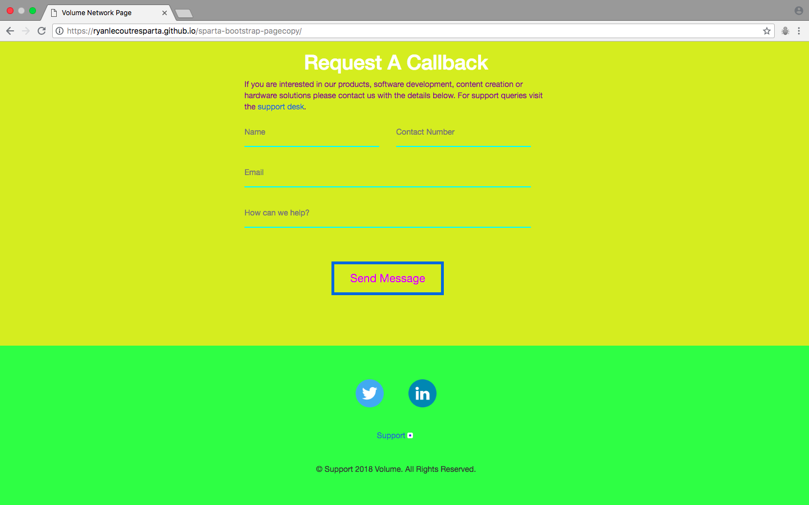

## sparta-bootstrap-pagecopy

##### Description: *A website that's based on the design of Volume Network's webpage, with the same text but my own images.*
**Creator: Ryan Lecoutre**

**Technology Used - HTML, CSS, Atom, MacDown and Bootstrap.**

## Challenges: 

### 1. Getting the logo into the top-left corner

### 2. Moving the first column in the first container up - to make it overlap with the image above.

### 3. Making the underline areas in the form section take up the entire width of the row they're in.

## Takeaways:

### 1. I further developed my understanding of Bootstrap.

### 2. Feel more comfortable creating a full website page.

### 3. The general HTML and CSS practice was beneficial.

## Link to GitHub Pages:

<https://ryanlecoutresparta.github.io/sparta-bootstrap-pagecopy/>

## Code Blocks:

How I managed to get the logo to the top-left:

```CSS
.logo-image {
  width: 93px;
  height: 93px;
  padding-left: 0px;
  float: left;
  transform: translateX(-20px);
}
```

How I got the first column to rise up into the image above (by using a negative value for margin-top):

```CSS
.column1 {
  background: rgba(246, 246, 251, 0.90);
  margin-top: -80px;
  padding-bottom: 40px;
  padding-left: 40px;
  padding-right: 80px;
}
```

How I got the rows to take up the entire width of the row in the form section (by seperating them into divs and using width: 100%):

```CSS
.form-details {
  background: inherit;
  padding: 15px 0px;
  width: 100%;
}
```

## Instructions on How to Download:

All code needed to run is within the repository. Git Clone command is all that is required.

## Website Images:




